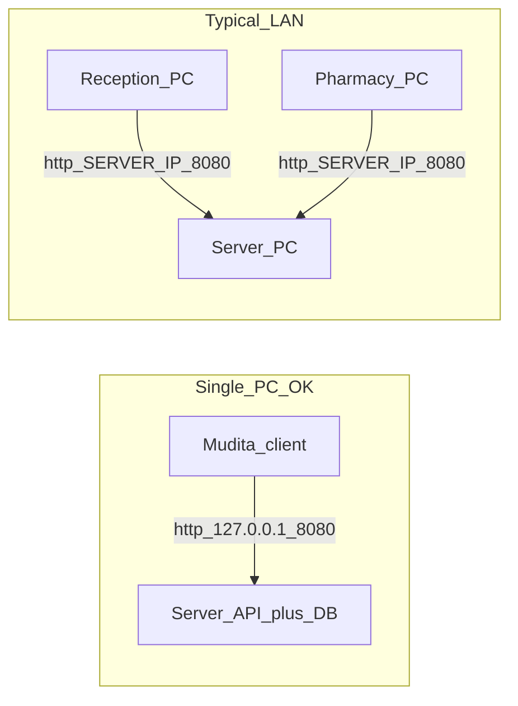

# Mudita Hospital — Field install FAQ

Take this to the customer site. For step-by-step commands see [DEPLOY.md](./DEPLOY.md). For daily staff use see [CHEATSHEET.md](./CHEATSHEET.md). Risk / continuity (installer & director): [RISK_AND_CONTINUITY.md](./RISK_AND_CONTINUITY.md). Crash laminate: [CRASH_RESTORE_CARD.md](./CRASH_RESTORE_CARD.md).

---

## Architecture (one picture)



| Setup | What to install |
|-------|-----------------|
| **One PC** (small clinic) | Server **and** Client on the same machine. First-run Server IP = `127.0.0.1` |
| **Several PCs** (typical) | Server on one always-on PC; Client on each reception / pharmacy / clinic desk. Clients use the server’s LAN IP (e.g. `192.168.1.10`) |

**Important:** Server and Client are **two separate packages**. There is no single setup that installs both. Order on site: **Server first → then Client(s)**.

All patient / stock / bill data lives **only on the server PC**. Clients are thin windows that talk over HTTP on port **8080**. No internet is required after you copy installers by USB.

---

## Where does the server live?

| Mode | Location |
|------|----------|
| **Hospital install** | `C:\MuditaHospital\Server\` |
| Contents | `mudita-api.exe`, `config.json`, `data\mudita.db`, `backups\`, watchdog scripts |
| **Autostart** | Windows scheduled task **MuditaHospitalAPI** (SYSTEM) via `run-watchdog.cmd` |
| **Your laptop (dev)** | Repo `server\` → DB at `server\data\mudita.db`; run `.\scripts\run-server.ps1` |

Hospital `config.json` uses `"host": "0.0.0.0"` so other PCs can connect. Do **not** leave the hospital server on `127.0.0.1` if reception/pharmacy PCs need access.

Health check:

- On server: `http://127.0.0.1:8080/api/health`
- From another PC: `http://SERVER_IP:8080/api/health` → `"status":"ok"`, `"db":"ok"`

---

## How do I package for USB? (before the visit)

On your **build PC** (Go + Node + Rust for client build):

```powershell
cd c:\Mudita_Software\Mudita-Hospital
.\scripts\package-server.ps1      # → dist\server-package\
.\scripts\package-client.ps1      # → dist\client-package\
.\scripts\package-dashboard.ps1   # → dist\dashboard-package\
```

Copy to USB, for example:

```
USB\
  Mudita\
    Server\     ← entire dist\server-package\
    Client\     ← entire dist\client-package\
    Dashboard\  ← entire dist\dashboard-package\
    Docs\       ← DEPLOY.md + FIELD_INSTALL_FAQ.md + CHEATSHEET.md
                  + RISK_AND_CONTINUITY.md + CRASH_RESTORE_CARD.md
                  (+ .html print layouts if useful)
```

### On the customer PC(s)

1. **Server machine** — Administrator PowerShell inside `Server\`:

   ```powershell
   .\install-server.ps1
   ```

   Default path: `C:\MuditaHospital\Server`. Sets firewall rule for port 8080 + startup task.

2. **Each clinic PC** — install the `.msi` / NSIS setup if present, **or** copy/run `MuditaHospital.exe`.

3. First client launch → enter Server IP → sign in.

4. **Director PC** (optional) — install the dashboard `.msi` / NSIS setup if present, **or** copy/run `MuditaDashboard.exe`. First launch → same Server IP → **Admin** login only.

Deep steps: [DEPLOY.md](./DEPLOY.md).

---

## How do I access the database as a developer?

| Fact | Detail |
|------|--------|
| Engine | **SQLite** (WAL mode). No MySQL/Postgres process. |
| Dev file | `server\data\mudita.db` (+ `-wal` / `-shm` while API is running) |
| Production file | `C:\MuditaHospital\Server\data\mudita.db` |
| Tools | [DB Browser for SQLite](https://sqlitebrowser.org/) or `sqlite3` CLI |

**Safe habits**

- Prefer **Admin → Settings → Backup**, then open a file under `backups\` for inspection.
- To edit the live DB: stop the API first (see “Restart the API” below). Opening the live file while the API writes can corrupt it.
- Do not commit `mudita.db` or backup dumps with real patient data to git.

---

## FAQ — customer day

### Can it run on a single PC?

**Yes.** Install Server + Client on one machine. Server IP = `127.0.0.1`. Good for a solo desk or a pilot. When they add a second desk later, keep the same Server and only install Client on the new PC (point at the server’s LAN IP).

### Do I need multiple PCs?

**No, not required.** Recommend multiple when reception and pharmacy work at the same time on different desks. Then: one Server PC (can be the quietest / always-on machine) + Client on each desk. Prefer **wired Ethernet**; avoid Wi‑Fi for billing if possible.

### Will “setup” install server and software at the same time?

**No.** Two packages:

1. `install-server.ps1` → API + DB folder + autostart  
2. Client MSI / `MuditaHospital.exe` → desktop app  

Install Server first so health check works before clients connect.

### Where will the server / data live?

Always on the **server PC disk**: `C:\MuditaHospital\Server\data\mudita.db`. Clients do **not** store the hospital database. If the server PC dies without backups, data is at risk — USB backup weekly.

### What are the default logins?

Fresh database:

| User | Password | Role |
|------|----------|------|
| `admin` | `admin123` | Admin (must change password on first login) |
| `reception` | `reception123` | Reception |
| `pharmacy` | `pharmacy123` | Pharmacy |

Change passwords before leaving the site. Create real staff users under Settings → Users (Admin).

### What is the first-run Server IP screen?

Client asks once for the API address. Examples:

- Same PC: `127.0.0.1` or “This PC”
- LAN: `192.168.1.10` (whatever static IP you set on the server)

Port **8080** is assumed. Badge should turn green: **Server connected**. If offline: Retry, Change server IP, check cable / power / firewall.

### What if the badge says Server offline?

1. Is the server PC on? Task **MuditaHospitalAPI** running?  
2. Browser on server: `http://127.0.0.1:8080/api/health`  
3. From client PC: `http://SERVER_IP:8080/api/health`  
4. Ethernet cable / switch / wrong IP  
5. Firewall port **8080** (install script usually adds the rule)

### How do backups work?

| Action | How |
|--------|-----|
| Backup now | Admin → Settings → **Backup** |
| Auto | Every 24h (default) into `C:\MuditaHospital\Server\backups\` |
| USB weekly | Copy that `backups\` folder to a labeled USB; keep off-site if possible |
| Restore | Admin → Backup → Restore (API restarts; wait ~5s, then Retry). **Replaces live data.** |

Only restore backups from **this** hospital.

### How do I restart the API?

**Administrator** PowerShell (Access Denied usually means the task runs as SYSTEM):

```powershell
Stop-ScheduledTask -TaskName "MuditaHospitalAPI"
Get-Process mudita-api -ErrorAction SilentlyContinue | Stop-Process -Force
Start-ScheduledTask -TaskName "MuditaHospitalAPI"
```

After a rebuild, copy the new `mudita-api.exe` into `C:\MuditaHospital\Server\` before starting the task again.

Dev laptop: stop `mudita-api` / Ctrl+C, then `.\scripts\run-server.ps1`.

### What is Training mode?

Admin → Settings → **Training**: seeds `DEMO-` items and `[TRAINING]` sample bills for practice. Reset only removes DEMO / TRAINING rows — not real users. Prefer a practice DB or Training seed for demos; do not teach on live cash without the hospital’s OK.

### Language / staff cheat sheet?

- App: **English / မြန်မာ** in the top bar.  
- Desk laminate: [CHEATSHEET.md](./CHEATSHEET.md) or Help → Print cheat sheet in the app (`?` key).  
- This file = **installer / developer** FAQ, not the reception laminate.

### Is internet required?

**No** after USB copy. Offline LAN only. Updates = bring a new USB package later.

### Hardware expectations?

Cheap Windows PCs (~2GB class) are in scope. Wired switch + static IP on the server. WebView2 is normally already on Windows 10/11 for the client.

### Uninstall server?

Admin PowerShell from the package folder:

```powershell
.\uninstall-server.ps1
# optional wipe DB/backups:
.\uninstall-server.ps1 -RemoveData
```

---

## Site checklist

### Before you leave the office

- [ ] `package-server.ps1` + `package-client.ps1` + `package-dashboard.ps1` on USB  
- [ ] This FAQ + DEPLOY.md + CHEATSHEET.md + RISK_AND_CONTINUITY + CRASH_RESTORE_CARD on USB  
- [ ] Know the planned static IP (or confirm single-PC `127.0.0.1`)

### Single-PC install

- [ ] Admin: `install-server.ps1`  
- [ ] Health: `http://127.0.0.1:8080/api/health`  
- [ ] Install / run client; Server IP `127.0.0.1`  
- [ ] Admin login → change password  
- [ ] (Optional) Install / run dashboard; Admin login  
- [ ] Backup now; show USB backup folder  
- [ ] Print or leave CHEATSHEET + CRASH_RESTORE_CARD (fill Server IP / support contact)  
- [ ] Leave-site items in [RISK_AND_CONTINUITY.md](./RISK_AND_CONTINUITY.md) if you will be away long  

### Multi-PC install

- [ ] Server: static IP + `install-server.ps1`  
- [ ] Health from a second PC: `http://SERVER_IP:8080/api/health`  
- [ ] Client on each desk → same Server IP  
- [ ] Reception + Pharmacy login smoke  
- [ ] Tiny OPD or restock on a client  
- [ ] (Optional) Dashboard on director PC → Admin login  
- [ ] Backup now + USB copy ritual agreed  
- [ ] Print CHEATSHEET + CRASH_RESTORE_CARD; fill blanks  

Full smoke list: [DEPLOY.md §4](./DEPLOY.md).
