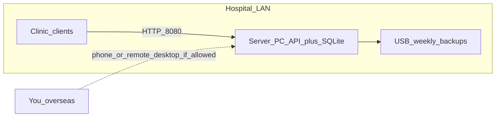

# Mudita Hospital — Risk & Continuity Answers

For installers and the hospital director. Staff day-to-day steps: [CHEATSHEET.md](./CHEATSHEET.md). Crash / restore laminate: [CRASH_RESTORE_CARD.md](./CRASH_RESTORE_CARD.md). Deploy steps: [DEPLOY.md](./DEPLOY.md).

Your system is an **offline LAN clinic app**: one always-on Windows **server PC** holds all data (`C:\MuditaHospital\Server\data\mudita.db`); reception/pharmacy PCs run thin clients over HTTP port **8080**. No internet is required after install.

---

## 1. Could the software fail to meet “hospital standard”?

Mudita is built for **OPD billing, OT case-cart, pharmacy stock, and cash reports** on a closed LAN—not as a certified medical device, full EHR, or life-support system.

| What “hospital standard” often means | Where Mudita stands |
|--------------------------------------|---------------------|
| Reliable day-to-day billing & stock for a small/mid clinic | Designed for this (watchdog autostart, WAL SQLite, role logins, print flows) |
| Regulatory / ISO / MoH software certification | **Not claimed** — that is a separate legal/process track |
| Clinical decision support that could kill if wrong | **Out of scope** — stock/billing errors are operational risk; clinical judgment stays with staff |

**What reduces the scare:** pilot with Training mode + shadow the paper system for 1–2 weeks; reconcile daily cash and physical stock counts; keep paper or Excel as fallback until staff trust the numbers.

---

## 2. What if a calculation is slightly off and the hospital loses money?

**Risk is real** for any billing software. Mitigation is process, not hope:

- **Daily cash report** (OPD + OT paid) vs physical cash drawer — every day.
- **Low stock / near expiry** reports vs shelf counts — weekly.
- Price mistakes are often **master-data** (wrong service/item price), not mysterious math — train Admin to audit Doctors/Services/Pharmacy prices.
- Voids require a reason (stock restore rules differ for OPD vs OT — staff must know that from the cheat sheet).

Software cannot guarantee zero money loss. **Human reconciliation** is the control. If a bug is found later, backups let you investigate historical bills; they do not automatically refund cash.

---

## 3. What if the installer goes overseas and the app crashes?

**Built-in resilience (no installer required):**

- Windows task **MuditaHospitalAPI** + watchdog restarts the API after restore / clean exit.
- Clients show **Server offline** and can Retry / change IP.

**Not built-in:** cloud monitoring, auto-push of fixes, or remote control without hospital help.

**Overseas playbook** (also on [CRASH_RESTORE_CARD.md](./CRASH_RESTORE_CARD.md)):

1. Server PC powered on? Green **Server connected**?
2. Browser on server: `http://127.0.0.1:8080/api/health`
3. Restart the scheduled task (commands in [FIELD_INSTALL_FAQ.md](./FIELD_INSTALL_FAQ.md)).
4. If DB corrupt: Admin → Restore from yesterday’s backup (or USB).
5. Call the support contact with photos of the badge / error.

Without a remote-desktop agreement (AnyDesk/TeamViewer/VPN) and a reachable person on site, support can coach by phone but cannot press buttons remotely.

---

## 4. How long can it last without developer supervision if only one staff is trained?

| Horizon | Realistic if… |
|---------|----------------|
| **Days–weeks** | Staff can bill, restock, print; server stays on; backups run |
| **1–3 months** | Weekly USB copy of `backups\` is actually done; one Admin password known; cheat sheet laminated |
| **Longer** | Second trained person + written “break glass” restore steps; support on call for rare failures |

One trained person is a **single point of failure** (see §7). The app does not expire; **knowledge and backup discipline** expire.

---

## 5. Can support help if not physically at the hospital?

| Method | Works? |
|--------|--------|
| Phone / chat + screenshots + FIELD_INSTALL_FAQ steps | Yes |
| Remote desktop (AnyDesk etc.) if hospital allows and PC is online | Yes — best for restore/reinstall |
| The Mudita app itself over the internet | **No** — offline LAN by design; no cloud admin console |

Agree **before** long absence: who has Admin, who owns the USB backups, and whether remote access is allowed.

---

## 6. Can people who know nothing about technology use this?

**Yes for daily desk work**, with training — that is why EN/မြန်မာ, Help/`?`, and [CHEATSHEET.md](./CHEATSHEET.md) exist.

**No for zero training:** first-run Server IP, login roles, OT reconcile, and Backup/Restore still need a short onboarding. Expect ~half-day for reception/pharmacy flows; Admin/backup needs extra time.

---

## 7. What if the trained person quits before a new member is trained?

**Prevent, don’t hope:**

- Laminate the cheat sheet at every desk.
- Keep **two** people who can sign in as Admin (or one Admin + written emergency password in a sealed envelope with the director).
- Training mode (`DEMO-` / `[TRAINING]`) for practice without touching live cash.
- Leave a one-page handoff: Server IP, backup USB location, who to call (see leave-site checklist below).

New hires can relearn from the laminate + Training seed; they cannot invent restore procedures without a written card.

---

## 8. What if there is a data gap?

Gaps usually mean: missed entry, voided bill, wrong stock adjust, or **backup gap** (days with no USB / failed auto-backup).

**Detection:** daily cash vs drawer; stock count vs system; movement history / reports.

**Recovery:** restore only recovers what was **backed up**. Gaps between last good backup and failure are gone unless staff still have paper receipts. Physical inventory recount is the stock safety net.

---

## 9. What if software is destroyed/uninstalled and the hospital still needs the data?

**Critical distinction** (also in [FIELD_INSTALL_FAQ.md](./FIELD_INSTALL_FAQ.md)):

- `uninstall-server.ps1` **without** `-RemoveData` → install folder/data can remain.
- `-RemoveData` → **wipes** DB/backups — avoid unless intentional.

**Survival path:** USB copy of `backups\` (and preferably a copy of `data\mudita.db` when API is stopped). Reinstall server package → Restore from backup → clients reconnect. Clients never held the hospital database, so reinstalling only clients does not lose data.

---

## 10. What if data is lost somehow — how can it ever be solved?

**Only from backups** (daily auto under `backups\` + weekly USB off the machine). There is no cloud replica.

If every copy is gone (disk wipe + no USB): **that history cannot be recovered**. Prevention is the product: Backup now on go-live, 24h auto, weekly USB, optional second PC or external drive.

---

## 11. How to transfer data to a completely new device?

1. On old server: Backup now; copy `backups\` (and/or stopped `mudita.db`) to USB.
2. On new PC: `install-server.ps1`, set static IP (or note new IP).
3. Admin → Restore chosen backup (replaces live DB; API restarts).
4. Point every client at the **new** Server IP; smoke-check health + one tiny bill.

Document the new IP on the laminated sheet.

---

## 12. Is data secure enough to trust unless someone physically steals it?

**No — do not use that mental model.**

What you **do** have:

- Role logins (Admin / Reception / Pharmacy), hashed passwords, session tokens, idle lock (~15 min), Admin-only settings/backup.
- Data stays on hospital LAN; not on the public internet by default.

What you **do not** have (today):

- **HTTPS/TLS** — traffic on the LAN is plain HTTP; a skilled person *on the same network* could sniff sessions more easily than “only physical theft.”
- **Encryption at rest** in the app — `mudita.db` is a normal file; anyone with Windows access to the server PC can copy it.
- Protection against **default passwords left unchanged**, shared Admin accounts, or staff walking USB backups out.

**Trust model that matches reality:** closed/wired LAN + changed passwords + locked server room/account + USB backups treated as confidential + Windows user accounts locked down. That is **clinic-grade LAN security**, not bank-grade or “only physical theft.”

---

## Bottom line

| Concern | Verdict |
|---------|---------|
| Hospital “standard” | Fit for LAN clinic ops if piloted & reconciled; not a certified clinical system |
| Money errors | Control with daily cash + stock counts + price audits |
| Installer overseas | Coachable; remote desktop if allowed; leave restore runbook |
| Unsupervised life | Months only with 2+ trained people + USB habit |
| Remote help | Phone yes; in-app cloud no |
| Non-tech users | Yes after short training + laminate |
| Staff turnover | Written handoff + second Admin + Training mode |
| Data gaps | Detect with process; recover only what’s backed up |
| Uninstall / new PC | OK if backups exist and `-RemoveData` unused |
| Total loss | Unrecoverable without backups — USB is mandatory |
| Security | Passwords + LAN isolation help; **not** “only physical steal” |

---

## Leave-site checklist (before long absence)

Do this **with hospital staff watching** before you leave for weeks/months:

1. [ ] Pilot 1–2 weeks parallel with paper; sign off daily cash match (or agree a shorter pilot in writing).
2. [ ] Change all default passwords; create real named users; **two** Admins (or sealed emergency Admin password with director).
3. [ ] Demonstrate **Backup → copy to USB → Restore** once; staff repeat it once.
4. [ ] Leave printed [CHEATSHEET](./CHEATSHEET.md) + [CRASH_RESTORE_CARD](./CRASH_RESTORE_CARD.md) + your contact number.
5. [ ] Agree remote-support tool (if any) and who keeps the server PC powered on.
6. [ ] Treat USB backups like patient/cash records — lock them up; label hospital name + date.
7. [ ] Write Server IP, backup USB location, and support contact on the crash card blanks.

Printable leave-site + crash card: [CRASH_RESTORE_CARD.pdf](./CRASH_RESTORE_CARD.pdf) (layout: [CRASH_RESTORE_CARD.html](./CRASH_RESTORE_CARD.html)). This document as PDF: [RISK_AND_CONTINUITY.pdf](./RISK_AND_CONTINUITY.pdf).
